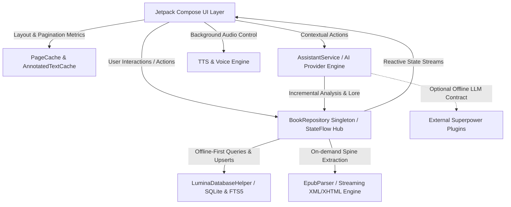

# Lumina Architecture & Design Documentation

Welcome to the architectural documentation for **Lumina**, an artisanal, offline-first digital EPUB reading space built natively with Kotlin and Jetpack Compose for Android.

This documentation captures the architectural principles, subsystem designs, trade-offs, and Architectural Decision Records (ADRs) that govern the codebase.

---

## 🗺️ Subsystem Architecture Map

---

## 📚 Architectural Guides & Decision Records

The architecture is documented across modular topic guides:

1. **[01. System Overview & Core Architecture](architecture/01-system-overview.md)**
   - Unidirectional Data Flow (UDF) & reactive `StateFlow` hub.
   - Offline-first philosophy and physical EPUB encapsulation.
   - Zero-dependency streaming XML/XHTML parser (`EpubParser.kt`).
   - Single-Activity edge-to-edge window insets and floating action mode integration.

2. **[02. Reader Engine, Dual-Mode Layout & Pagination](architecture/02-reader-engine-and-pagination.md)**
   - Dual reading engines: Continuous vertical scroll (`LazyColumn`) and Paged horizontal swipe (`HorizontalPager`).
   - 60/120 FPS Zero-Jank mandate: LRU `PageCache` layout budget and `AnnotatedTextCache`.
   - Display cutout, notch-safety, and dynamic typography metrics.

3. **[03. Floating Assistant Orb & Radial Action Menu](architecture/03-floating-assistant-orb.md)**
   - Dual-Orb architecture: Docked edge size (`OrbSize`) vs Radial palette size (`OrbMenuSize`).
   - Magnetic edge-snapping physics and touch collision resolution.
   - 2-layer concentric semicircle arc radial geometry with inward fanning vectors.
   - Assistant voice overlay, auto-mic behavior, and gesture mapping.

4. **[04. Storage, In-Memory Caching & SQLite FTS Search](architecture/04-storage-caching-and-fts.md)**
   - SQLite relational schema (`LuminaDatabaseHelper`) and atomic transaction management.
   - In-memory `chaptersCache` eliminating high-frequency disk I/O.
   - Decoupled background FTS5/FTS4 search indexing preventing application startup lag.
   - Debounced persistence for high-frequency reader progress tracking.

5. **[05. AI Assistant, Incremental Lore & Dramatis Personae](architecture/05-ai-assistant-and-lore-extraction.md)**
   - Multi-provider AI framework (Google Gemini, OpenAI, and offline plugin architecture).
   - Paragraph-delta checkpointing for zero-redundancy token consumption.
   - Canonical entity matching and alias resolution preventing duplicate character creation.
   - Anti-spoiler contextual shielding and voice query pipeline.

6. **[06. Theming Engine & Typography Design System](architecture/06-theming-and-design-system.md)**
   - 12+ artisanal themes across 4 design families (Paper, Dark, OLED, Vibrant).
   - Strict `MaterialTheme.colorScheme` token adherence (zero hardcoded hex values).
   - Dynamic fluid font sizing, line heights, letter spacing, and reading ergonomics.

---

## 🔍 Specific Deep Dives

- **[Deep Dive: Startup & Reader Performance Optimization](architecture/startup-and-reader-performance.md)**
- **[Deep Dive: Character Generation, Anti-Duplication & Caching](architecture/character-generation-and-caching.md)**
- **[Plugin System Specification (Superpowers)](superpowers/specs/2026-09-06-plugin-system-design.md)**

---

## 🏛️ Foundational Invariants

All future modifications to Lumina must respect the following core tenets:
- **Main Thread Purity**: All disk, DB, parser, and network I/O must run on `Dispatchers.IO`.
- **Zero Heavy Computations in Composition**: Never compute regex splits, line pagination, or AST traversals in `@Composable` render blocks.
- **Physical File Isolation**: Books and EPUB assets remain strictly sandboxed in `context.filesDir/epubs/<id>.epub`.
- **Strict FOSS & F-Droid Compliance**: Zero proprietary analytics, ads, or closed-source telemetry SDKs.
