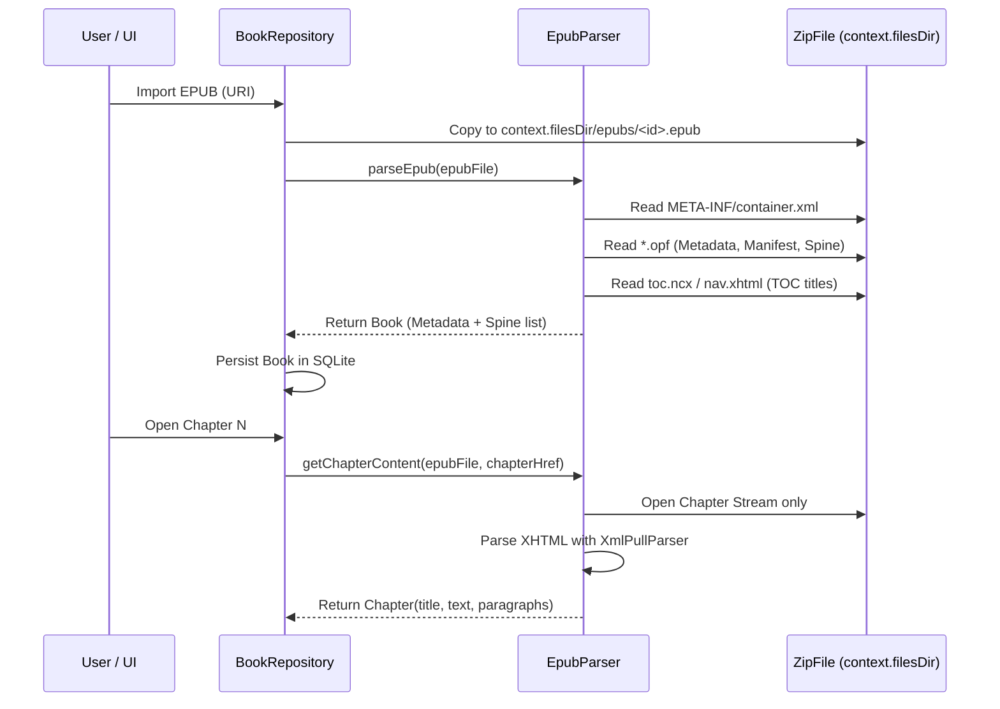

# 01. System Overview & Core Architecture

## 📌 Architectural Vision

Lumina is an offline-first, artisanal EPUB reading application for Android designed with strict performance budgets, typography craftsmanship, and privacy guarantees. Unlike hybrid or WebView-based reading apps, Lumina is built entirely in **pure Kotlin** and **Jetpack Compose**, treating typography, text rendering, and layout calculations as first-class native citizens.

---

## 🏛️ High-Level System Architecture

Lumina follows a strict **Unidirectional Data Flow (UDF)** and repository pattern:

```mermaid
graph TD
    subgraph UI Layer [Jetpack Compose UI Layer]
        MainActivity[MainActivity]
        LibraryScreen[LibraryScreen]
        ReaderScreen[ReaderScreen]
        FloatingOrb[FloatingAssistantOrb]
        Sheets[Settings & TOC Sheets]
    end

    subgraph Domain & State [Reactive State Hub]
        BookRepo[BookRepository Singleton]
        StateFlows[StateFlow: books, settings, bookmarks, characters]
    end

    subgraph Data & Storage [Persistence & Parsing]
        DB[LuminaDatabaseHelper / SQLite + FTS5]
        Parser[EpubParser / Streaming XML/XHTML]
        FileSystem[App-Private Storage / context.filesDir/epubs/]
    end

    subgraph External & AI [AI & Online Services]
        Assistant[AssistantService / Gemini & OpenAI]
        OnlineCat[OnlineEpubService / Standard Ebooks & Gutenberg]
        Dict[DictionaryService / Wiktionary]
    end

    MainActivity --> LibraryScreen
    MainActivity --> ReaderScreen
    ReaderScreen --> FloatingOrb
    ReaderScreen --> Sheets

    UI Layer -->|Emit User Actions| BookRepo
    BookRepo -->|Collect State| UI Layer

    BookRepo -->|CRUD Operations| DB
    BookRepo -->|Stream & Extract Spine| Parser
    BookRepo -->|Import & Cache EPUB Files| FileSystem
    Parser -->|Read ZIP Streams| FileSystem

    BookRepo -->|Lore & Character Generation| Assistant
    LibraryScreen -->|Fetch Catalog & Downloads| OnlineCat
    ReaderScreen -->|Contextual Definitions| Dict
```

---

## 🏗️ Architectural Decision Records (ADRs)

### ADR 01-1: Unidirectional Data Flow with Singleton Repository Hub
* **Status**: Accepted & Implemented
* **Component**: `BookRepository.kt`

#### Problem Context
In complex multi-screen reading apps, state drift easily occurs between reading progress, library shelf updates, settings modals, and background AI indexing if state is decentralized across multiple ViewModels or fragmented local states.

#### Alternatives Considered
1. **Multiple Fragment-Scoped ViewModels**: Higher boilerplate, difficult synchronization when background tasks (like text-to-speech or AI lore extraction) need to update reading state while the reader screen is inactive.
2. **Global EventBus / Broadcaster**: Hard to trace state history, prone to race conditions and memory leaks.
3. **Singleton Repository with `StateFlow` streams**: Centralized truth, fully reactive, lifecycle-agnostic, and easily testable.

#### Decision
Implement `BookRepository` as a thread-safe Kotlin singleton backed by Kotlin Coroutines and `StateFlow` primitives (`books`, `currentBook`, `settings`, `bookmarks`, `characters`, `lore`, `readerMode`).
- All state mutations are handled via explicit suspend functions on `BookRepository` executing on `Dispatchers.IO`.
- UI Composables observe immutable state models and emit intent events up to the repository.

#### Tradeoffs & Invariants
* **Advantage**: Zero state desynchronization across UI, background audio, and database operations.
* **Discipline Required**: Composables must never perform out-of-band direct SQLite queries; all operations must flow through `BookRepository`.

---

### ADR 01-2: Zero-Dependency Streaming XML/XHTML EPUB Parser
* **Status**: Accepted & Implemented
* **Component**: `EpubParser.kt`

#### Problem Context
EPUB files are packaged ZIP archives containing XML metadata (`container.xml`, `.opf` package files, `.ncx`/Nav XHTML) and XHTML/HTML chapter contents. Typical third-party EPUB parsing libraries (such as Epublib or FolioReader) introduce massive transitive dependencies, bloated release APK sizes, out-of-date Apache Commons dependencies, and slow in-memory DOM object trees that allocate tens of megabytes of memory.

#### Alternatives Considered
1. **Third-Party Java/Kotlin EPUB Engines (e.g., Epublib, Readium)**: Bulky (>5-10 MB increase in APK size), heavy memory footprints, inflexible chapter streaming.
2. **Zero-Dependency Android `XmlPullParser` & `ZipInputStream`**: Native Android framework components, streaming directly from disk streams with near-zero allocation overhead.

#### Decision
Implement `EpubParser.kt` from scratch using standard `java.util.zip.ZipFile` / `ZipInputStream` and Android's native `org.xmlpull.v1.XmlPullParser`.
- **Streaming Spine Extraction**: Only package metadata, manifest items, and the spine order are parsed during book import.
- **On-Demand Chapter Parsing**: Chapter XHTML is read from the ZIP archive only when requested by the reader or caching engine.
- **HTML/XHTML Normalization**: Rich text is converted into structured paragraphs while stripping extraneous web formatting, scripts, and CSS that degrade native Compose typography.



#### Tradeoffs & Invariants
* **Advantage**: Release APK remains under 15 MB. Extreme speed on low-end hardware.
* **Constraint**: Multi-megabyte EPUBs must never be read into memory in their entirety. Spine chapters are loaded on-demand.

---

### ADR 01-3: Pure Native Jetpack Compose Architecture
* **Status**: Accepted & Implemented
* **Component**: `MainActivity.kt`, `ReaderScreen.kt`, `LibraryScreen.kt`

#### Problem Context
Many e-readers use embedded `WebView` components to render book text. However, WebViews introduce noticeable scrolling jank, touch latency, high memory consumption, and disjointed theming (clashes between web CSS and Android system themes).

#### Alternatives Considered
1. **WebView-based Reader**: Easy initial HTML rendering, but poor frame rates, high memory footprint, complex two-way JavaScript bridging for selection, and inability to integrate native Jetpack Compose floating UI elements seamlessly.
2. **Pure Jetpack Compose Native Reader**: 60/120 FPS hardware-accelerated rendering, exact control over typography layout metrics, seamless theme transitions (OLED Black, Warm Parchment), and instant integration with Compose gesture detectors.

#### Decision
Build the entire reader canvas directly in Jetpack Compose using native `Text`, `SelectionContainer`, `LazyColumn`, and `HorizontalPager` with custom pagination calculations.
- Display insets (`WindowInsets.systemBars`, `displayCutout`) are handled natively to prevent text collision on notched or hole-punch displays.
- Floating ActionMode overrides in `MainActivity.kt` enable custom contextual menus (Wiktionary lookup, AI explanation, citations, bookmarks) without OS-level text selection toolbar flickering.

---

## 📊 Summary of Core Invariants

| Layer | Responsibility | Golden Rule |
| :--- | :--- | :--- |
| **UI (`ui/*`)** | Pure rendering of domain state via Compose | Zero heavy computation (regex, string splits) inside render scopes. |
| **Domain (`model/*`)** | Immutable data models (`Book`, `Chapter`, `Settings`) | All models are immutable Kotlin `data class` types. |
| **Repository (`data/*`)** | State management, caching orchestration, and I/O dispatch | All I/O offloaded to `Dispatchers.IO`. |
| **Database (`db/*`)** | SQLite relational storage & FTS search | In-memory indexing and batch operations with safe upgrades. |
