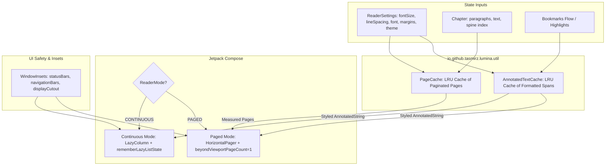

# 02. Reader Engine, Dual-Mode Layout & Pagination

## 📌 Subsystem Overview

The reader engine in Lumina (`ReaderScreen.kt`) is the core surface where users consume text. It supports two distinct reading paradigms:
1. **Continuous Vertical Scroll**: Fluid, continuous lazy-loaded reading canvas.
2. **Paged Horizontal Swipe**: Discrete, book-like page flipping with simulated physical page boundaries.

Achieving a rock-solid 60 FPS / 120 FPS reading experience on high-refresh Android displays requires strict separation between layout calculations (measuring line-heights, character counts, and page splits) and composition rendering.

---

## 🏗️ Architecture & Data Flow



---

## 🏛️ Architectural Decision Records (ADRs)

### ADR 02-1: Dual-Mode Reading Engine (Continuous Scroll vs Paged Mode)
* **Status**: Accepted & Implemented
* **Component**: `ReaderScreen.kt`, `ReaderMode` enum

#### Problem Context
Readers have strongly divided preferences: some prefer the modern, frictionless vertical scroll of web articles, while others demand the discrete pagination and focus of traditional e-ink and physical books.

#### Alternatives Considered
1. **Single Continuous Mode Only**: Simpler codebase, but alienates readers who prefer fixed page-turning and swipe gestures.
2. **Single Paged Mode Only**: Difficult to handle rapid navigation across long technical manuals or footnotes.
3. **Dual Mode Dynamic Switcher**: Support both modes seamlessly while sharing reading position progress (`currentChapter`, `currentProgress`).

#### Decision
Implement a toggleable `ReaderMode` (`CONTINUOUS` vs `PAGED`):
- **Continuous Mode**: Built using `LazyColumn` with paragraph-level keys (`key = { index }`) and sticky/floating chapter headers.
- **Paged Mode**: Built using `HorizontalPager` with `beyondViewportPageCount = 1` to pre-render adjacent pages and eliminate frame drops during active swipe gestures.
- **Progress Normalization**: Reading position is normalized as a float percentage `[0.0, 1.0]` across the chapter, allowing instant, lossless mode switching.

---

### ADR 02-2: LRU `PageCache` & `AnnotatedTextCache` for Zero-Jank Rendering
* **Status**: Accepted & Implemented
* **Component**: `PageCache.kt`, `AnnotatedTextCache.kt`

#### Problem Context
Calculating text pagination (e.g. breaking a 10,000-word chapter into exact device-screen-sized pages based on font size, line spacing, margins, and screen dimensions) and formatting highlighted text spans requires measuring text layouts. Executing these calculations inside a Composable body or during an active drag/scroll gesture triggers massive frame drops and garbage collection churn.

#### Alternatives Considered
1. **Compute Pagination in Composable `remember` Blocks**: Re-computes on configuration changes or recompositions, blocking the main thread during scrolling.
2. **Pre-Paginate Entire Books on Import**: Very slow book import times, and invalidated whenever the user changes font size or line spacing.
3. **Two-Tier LRU Memory Cache with Parametric Keys**: Paginate on-demand when a chapter is opened, caching pages using a composite key: `(chapterId, fontSize, lineSpacing, fontFamily, screenWidth, screenHeight, margins)`.

#### Decision
Implement `PageCache` and `AnnotatedTextCache` as LRU caches:
```kotlin
data class PageCacheKey(
    val chapterId: String,
    val fontSizeSp: Float,
    val lineHeightMultiplier: Float,
    val fontFamily: String,
    val containerWidthPx: Int,
    val containerHeightPx: Int,
    val horizontalMarginDp: Int,
    val verticalMarginDp: Int
)
```
- **LRU Invalidation**: If the user adjusts font size or switches orientation, old entries are naturally evicted without requiring full database rebuilds.
- **Span Pre-Indexing**: Bookmarks and highlights are pre-grouped by chapter (`bookmarks.groupBy { it.chapter }`) before entering list render scopes.

---

### ADR 02-3: Notch, Cutout, and Window Insets Handling
* **Status**: Accepted & Implemented
* **Component**: `ReaderScreen.kt`, `ReaderTopBar.kt`, `ReaderBottomDock.kt`

#### Problem Context
Modern Android devices feature diverse physical cutouts (notches, hole-punches, rounded corners, pill cutouts). Immersive full-screen reading modes frequently cut off top lines of text or obscure progress indicators behind hardware cutouts.

#### Alternatives Considered
1. **Force Letterboxing / Black Bars**: Destroys the immersive reading experience and wastes valuable screen real estate.
2. **Static Padding**: Hardcoded paddings look broken on devices with varying status bar or camera cutout heights.
3. **Adaptive `WindowInsets` & `displayCutout` Clamping**: Dynamically query `WindowInsets.displayCutout` and `WindowInsets.safeDrawing` to pad only when chrome is visible or when text bounds intersect with physical cutouts.

#### Decision
- In full-screen mode, content is padded by `WindowInsets.displayCutout.asPaddingValues()` while respecting user-configured margin sliders.
- Reader chrome (top bar and bottom dock) uses `WindowInsets.statusBars` and `WindowInsets.navigationBars` with animated alpha transitions (`AnimatedVisibility`) so they glide out of view smoothly without causing content relayout jumps.

---

## ⚡ Performance Verification Rules

To maintain the 60/120 FPS invariant:
1. **Stable Keys**: Every item in `LazyColumn` or `HorizontalPager` must provide a unique, deterministic `key`.
2. **No Regex in Render**: Never run regex search or text splitting inside `item { ... }`.
3. **Beyond Viewport Pre-fetching**: Always configure `beyondViewportPageCount = 1` on `HorizontalPager`.
