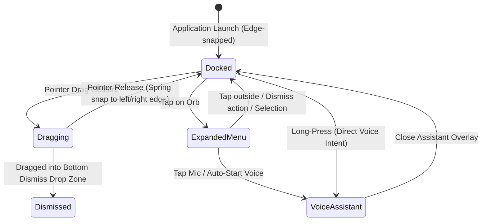
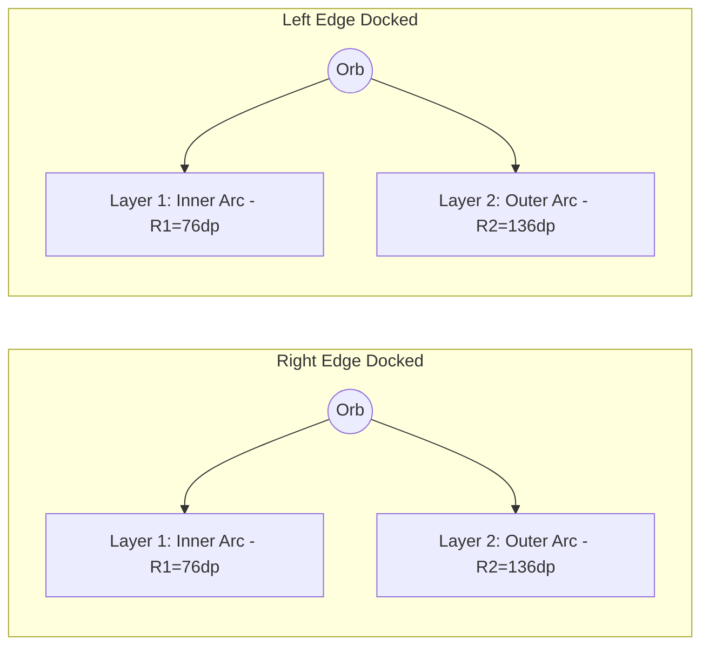

# 03. Floating Assistant Orb & Radial Action Menu

## 📌 Subsystem Overview

The **Floating Assistant Orb** (`FloatingAssistantOrb.kt`) is Lumina's signature contextual interaction hub. It provides an unobtrusive, edge-docked floating control that expands into a radial action palette and launches voice-driven AI interactions, text-to-speech (TTS) audio narration, theming toggles, and reading settings.

---

## 🏗️ State & Interaction Architecture

---

## 🏛️ Architectural Decision Records (ADRs)

### ADR 03-1: Dual-Orb Architecture (Edge Dock Size vs Menu Palette Size)
* **Status**: Accepted & Implemented
* **Component**: `FloatingAssistantOrb.kt`, `OrbSize`, `OrbMenuSize` enums

#### Problem Context
When the orb is resting on the screen edge during reading, users require it to be as small and unobtrusive as possible so it does not obstruct text. However, when tapped, the expanded radial menu buttons must be large, finger-friendly touch targets (accessible touch targets). Combining resting size and expanded menu size into a single scale factor compromised one or the other.

#### Decision
Decouple edge dock sizing from radial menu button sizing into two independent configuration enums:

1. **`OrbSize` (Resting Edge Scale)**:
   - `NANO` (0.55x — 28dp): Default, ultra-minimalist footprint.
   - `MINI` (0.70x — 36dp)
   - `COMPACT` (0.85x — 44dp)
   - `DEFAULT` (1.00x — 52dp)
   - `LARGE` (1.25x — 64dp)

2. **`OrbMenuSize` (Expanded Radial Palette Scale)**:
   - `COMPACT` (0.85x — 44dp button targets)
   - `MEDIUM` (1.00x — 52dp button targets): Default
   - `LARGE` (1.20x — 62dp button targets)

---

### ADR 03-2: Semicircle Radial Geometry (2-Layer Concentric Inward Arc)
* **Status**: Accepted & Implemented
* **Component**: `FloatingAssistantOrb.kt`

#### Problem Context
A full 360-degree radial wheel places half of its buttons off-screen when the orb is docked against the left or right display edge. Furthermore, placing all action items on a single radial ring becomes overly dense or extends beyond screen bounds.

#### Decision
Enforce a **2-Layer Concentric Semicircle Arc** fanning inward from the docked screen edge:

#### Angular Coordinate Transformation
When docked on the **Left Edge**:
- Angles fan into the screen from **-80° (top-right)** to **+80° (bottom-right)** centered at 0° (due East).

When docked on the **Right Edge**:
- Angles fan into the screen from **100° (bottom-left)** to **260° (top-left)** centered at 180° (due West).

#### Layer Item Distribution
- **Layer 1 (Inner Arc, $R_1 \approx 76\text{dp}$)**: Primary high-frequency quick actions (TTS Play/Pause, Add Bookmark, Theme Toggle, Reading Settings).
- **Layer 2 (Outer Arc, $R_2 \approx 136\text{dp}$)**: Secondary contextual actions (AI Assistant, Wiktionary, Lore Guide, Search).

---

### ADR 03-3: Auto-Mic Start & Voice Assistant Overlay
* **Status**: Accepted & Implemented
* **Component**: `AdvancedSettingsScreen.kt`, `AssistantService.kt`, `ReaderScreen.kt`

#### Problem Context
When expanding the voice assistant overlay, some users want instant microphone listening (zero-tap speech input), while users in quiet environments or reading in public prefer text-first input without unwanted microphone activation.

#### Decision
- Add a user preference `autoStartMic: Boolean` in `ReaderSettings` and `AdvancedSettingsScreen.kt`.
- When `autoStartMic` is `true`, opening the assistant immediately triggers speech recognition.
- When `autoStartMic` is `false`, the assistant opens in quiet text-input mode with a manual microphone start button.

---

### ADR 03-4: Action Palette Focus & TOC Exclusion
* **Status**: Accepted & Implemented
* **Component**: `OrbActionItem`

#### Decision
Table of Contents (TOC) is intentionally excluded from the radial orb palette. TOC is a high-density, multi-level hierarchy best explored via full-height bottom sheets (`TableOfContentsSheet`) invoked from the reader top bar or bottom dock. Keeping the orb menu focused on rapid, atomic actions (1-tap bookmarks, audio toggle, quick theme flips) preserves radial menu ergonomics.
