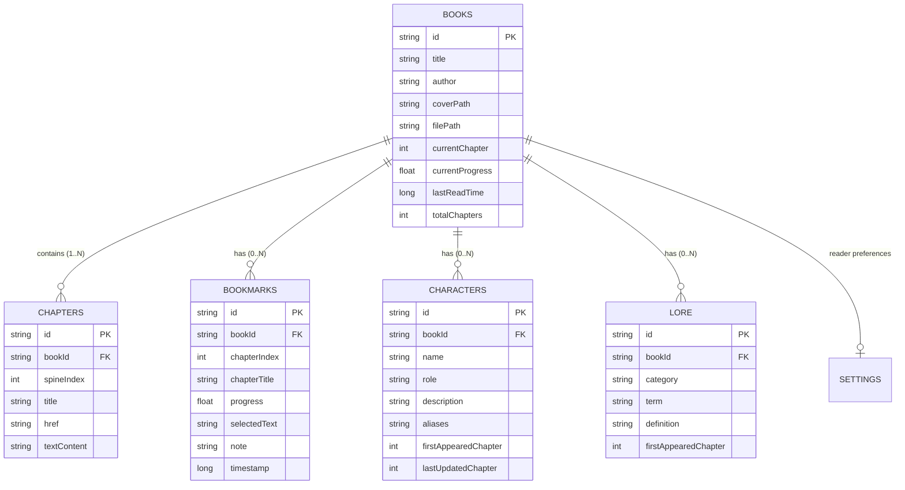
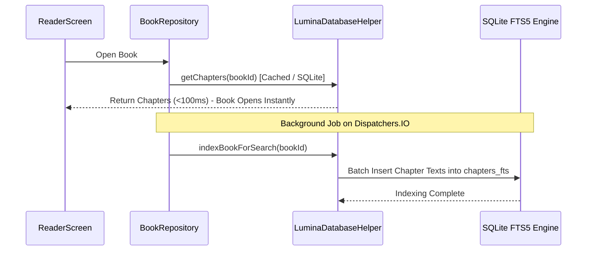

# 04. Storage, In-Memory Caching & SQLite FTS Search

## 📌 Subsystem Overview

Lumina’s storage architecture is built around an offline-first SQLite database managed by `LuminaDatabaseHelper.kt`. The database maintains relational integrity for books, chapters, bookmarks, reading progress, reader settings, and AI-generated lore entities.

---

## 🗄️ Relational Schema Diagram



---

## 🏛️ Architectural Decision Records (ADRs)

### ADR 04-1: In-Memory `chaptersCache` & Decoupled Chapter Deserialization
* **Status**: Accepted & Implemented
* **Component**: `LuminaDatabaseHelper.kt`, `BookRepository.kt`

#### Problem Context
Previously, reading operations and search lookups triggered repetitive SQLite queries to deserialize large text payloads from the `chapters` table. On books with 50+ chapters, reading progress tracking and rapid chapter switching caused main-thread stalls.

#### Alternatives Considered
1. **Query SQLite on Every Chapter Navigation**: Causes frequent disk reads and cursor allocations.
2. **Load All Chapters of All Books on Boot**: Massive memory consumption that would cause Out-Of-Memory (OOM) errors on large libraries.
3. **Per-Book In-Memory Concurrent LRU Cache**: Cache the chapter metadata and text of the currently open book in memory, populated upon book opening.

#### Decision
Implement `chaptersCache` inside `LuminaDatabaseHelper`:
```kotlin
private val chaptersCache = ConcurrentHashMap<String, List<Chapter>>()
```
- When a book is loaded via `getChapters(bookId)`, the database queries SQLite once, populates `chaptersCache[bookId]`, and serves subsequent lookups directly from RAM.
- When a book is deleted or modified, cache entries are invalidated atomically.

---

### ADR 04-2: Decoupled Background FTS5/FTS4 Indexing
* **Status**: Accepted & Implemented
* **Component**: `LuminaDatabaseHelper.kt`, `InBookSearchDialog.kt`

#### Problem Context
Earlier versions of the app initialized SQLite Full-Text Search (FTS) index builds during book opening and repository initialization. On multi-megabyte books with dozens of chapters, building the FTS table on startup locked the database and froze the UI for 1–2 minutes.

#### Alternatives Considered
1. **Synchronous Indexing on App Start**: High startup latency, ANR risks on older devices.
2. **No FTS (Naive SQL `LIKE %query%`)**: Extremely slow full-book text searches, cannot rank relevance or handle stemming.
3. **Decoupled Background Coroutine Indexing with In-Memory Search Fallback**: Book opens immediately; FTS indexing is dispatched to `Dispatchers.IO` in the background. Instant in-memory searching operates over loaded chapters while indexing completes.

#### Decision
- **Decouple from Open Path**: Books open in <100ms. FTS indexing runs asynchronously in the background.
- **FTS Engine Fallback**: The database attempts to create an `FTS5` virtual table (`chapters_fts USING fts5(...)`). If running on an older SQLite build lacking FTS5, it gracefully falls back to `FTS4`.
- **Instant Search**: While FTS indexes are warm, `InBookSearchDialog.kt` can search the in-memory chapter list instantly, providing immediate UI search results.



---

### ADR 04-3: Debounced Reading Progress Persistence
* **Status**: Accepted & Implemented
* **Component**: `BookRepository.kt`, `ReaderScreen.kt`

#### Problem Context
During continuous vertical scrolling, scroll position events fire at 60–120 Hz. Directly issuing SQLite `UPDATE books SET currentProgress = ...` on every scroll frame causes severe database lock contention and battery drain.

#### Decision
- In-memory `StateFlow` updates immediately to ensure UI elements (progress bars, page indicators) reflect the exact scroll position with zero latency.
- Database write operations are **debounced** (e.g. 500ms debounce or written on chapter change / app backgrounding events) via Kotlin Coroutines.
