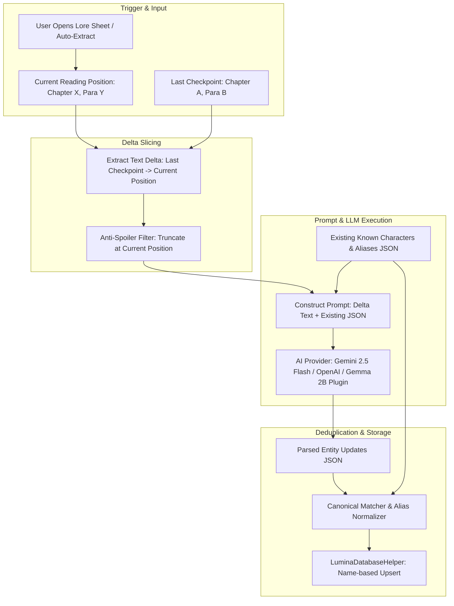
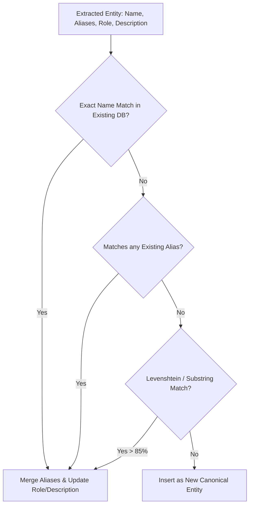

# 05. AI Assistant, Incremental Lore & Dramatis Personae

## 📌 Subsystem Overview

Lumina features an intelligent context-aware reading companion (`AssistantService.kt`) capable of:
1. **Dramatis Personae & Lore Extraction**: Incrementally identifying recurring characters, factions, and world terminology.
2. **Contextual In-Book Question Answering**: Answering questions regarding the plot, characters, and complex prose without revealing spoilers.
3. **Voice & Intent Processing**: Handling voice commands and questions via speech-to-text and AI analysis.

---

## 🏗️ AI Workflow & Anti-Duplication Pipeline

---

## 🏛️ Architectural Decision Records (ADRs)

### ADR 05-1: Multi-Provider Architecture with Offline Plugin Bridge
* **Status**: Accepted & Implemented
* **Component**: `AssistantService.kt`, `AiProvider` enum, `docs/superpowers/specs/2026-09-06-plugin-system-design.md`

#### Problem Context
Users require flexibility in AI model selection: some prefer Google Gemini (with high speed and large context windows), others prefer OpenAI models, while privacy-conscious or offline readers require local LLMs (such as Gemma 2B running on-device).

#### Decision
- Abstract AI capabilities behind `AssistantService` supporting configurable `AiProvider` types (`GEMINI`, `OPENAI`, `OFFLINE_PLUGIN`).
- Maintain zero proprietary analytics or hardcoded model vendor lock-ins.
- Local LLM inference is decoupled into an optional F-Droid compliant companion plugin APK via Android Intent/AIDL contracts, keeping the core Lumina APK lean (<15 MB).

---

### ADR 05-2: Incremental Paragraph Delta Checkpointing
* **Status**: Accepted & Implemented
* **Component**: `AssistantService.kt`, `BookRepository.kt`

#### Problem Context
Analyzing an entire novel repeatedly on every chapter change consumes massive API token quotas, introduces 10–30 second latency, and risks token limit errors on large books.

#### Decision
Implement **Incremental Paragraph-Delta Slicing**:
- The repository tracks the last analyzed reading position: `(lastAnalyzedChapter, lastAnalyzedParagraph)`.
- When character or lore extraction is triggered at reading position `(currentChapter, currentParagraph)`, the system extracts only the text between the previous checkpoint and the current position.
- If the delta is less than a minimum threshold (e.g. fewer than 3 paragraphs), the call is short-circuited to conserve tokens and battery.

---

### ADR 05-3: Canonical Name Matching & Alias Resolution
* **Status**: Accepted & Implemented
* **Component**: `AssistantService.kt`, `LuminaDatabaseHelper.kt`

#### Problem Context
LLMs frequently refer to the same character using different variations (e.g. "Elizabeth Bennet", "Elizabeth", "Eliza", "Miss Bennet", "Lizzy"). In earlier implementations, this caused duplicate cards to appear in the Character Guide sheet.

#### Decision
Enforce a two-tier deduplication protocol:

1. **Prompt-Level Grounding**: The existing known character roster is passed to the LLM as structured JSON, with explicit system instructions to update existing entries or attach new aliases rather than emitting new entities.
2. **Database-Level Canonical Upsert**: `LuminaDatabaseHelper.upsertCharacter(...)` normalizes names, checks for alias collisions, and merges metadata rather than blindly inserting new rows.

---

### ADR 05-4: Anti-Spoiler Context Shielding
* **Status**: Accepted & Implemented
* **Component**: `AssistantService.kt`

#### Problem Context
When readers ask questions about characters or plot points, conventional RAG systems or LLM prompts that search the entire book will accidentally reveal future deaths, plot twists, or endings.

#### Decision
- All context sent to the AI is strictly bounded by the user's current reading position `currentProgress` in `currentChapter`.
- The system prompt explicitly instructs the model: *"You are an assistant for a reader currently at Chapter X. Never reveal events, character fates, or plot revelations that occur beyond this point."*
