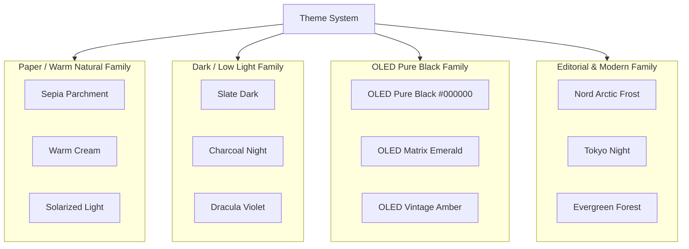

# 06. Theming Engine & Typography Design System

## 📌 Subsystem Overview

Lumina is designed as an artisanal reading sanctuary. Visual comfort and typographic harmony across varying lighting conditions are first-class architectural requirements. The theming subsystem (`ThemeMode`, `ThemeFamily`, `ThemeVariant`) provides a tokenized design system spanning 12+ curated palettes.

---

## 🎨 Theme Hierarchy & Families

---

## 🏛️ Architectural Decision Records (ADRs)

### ADR 06-1: Strict Theme Token Adherence (Zero Hardcoded Hex Values)
* **Status**: Accepted & Implemented
* **Component**: `Theme.kt`, `ReaderScreen.kt`, `Sheets.kt`, `FloatingAssistantOrb.kt`

#### Problem Context
Hardcoding raw color values (e.g. `Color(0xFF121212)` or `Color.White`) in UI composables creates visual bugs when users switch between high-contrast OLED black, warm parchment, and soft daylight themes. A white background hardcode in a sheet or floating orb breaks readability and creates eye strain in dark environments.

#### Decision
- **Zero Hex Policy**: No UI Composable may contain hardcoded hex colors for surfaces, borders, text, or icons.
- **Token Resolution**: All colors must resolve dynamically through `MaterialTheme.colorScheme` or reader-specific semantic tokens:
  - `background`: Canvas / page background
  - `onBackground`: Primary reading typography
  - `surface` / `surfaceVariant`: Sheets, modal cards, and floating orb surfaces
  - `primary`: Interactive accents and active chapter indicators
  - `outline`: Subtle dividers and border contours

---

### ADR 06-2: OLED Pure Black Power Optimization
* **Status**: Accepted & Implemented
* **Component**: `ThemeVariant.OLED_BLACK`

#### Problem Context
On AMOLED and OLED mobile displays, pure black pixels (`#000000`) completely shut off pixel power draw, extending battery life during multi-hour reading sessions. However, standard Android dark themes use off-black dark grays (e.g., `#121212`) which do not achieve true pixel-off power savings.

#### Decision
- Provide dedicated OLED Black variants where background surface colors evaluate strictly to `Color(0xFF000000)`.
- Text contrast in OLED Black is calibrated with softened off-white tones (`#E0E0E0` rather than harsh `#FFFFFF`) to prevent excessive light blooming and eye fatigue.

---

### ADR 06-3: Parametric Typography & Reading Ergonomics
* **Status**: Accepted & Implemented
* **Component**: `ReaderSettings.kt`, `PageCache.kt`

#### Supported Typographic Parameters
Readers can finely customize:
- **Font Scale**: 12sp to 36sp with fluid typographic scaling.
- **Line Height Multiplier**: 1.1x (compact) to 2.2x (spacious).
- **Letter Spacing & Word Spacing**: Fine-grained kerning adjustments.
- **Font Families**: System Default, Serif (Literata / Merriweather), Sans-Serif (Inter / Roboto), Monospace (Fira Code), and OpenDyslexic.
- **Margin Padding**: Horizontal and vertical margin sliders that recalculate `PageCache` page boundaries.
