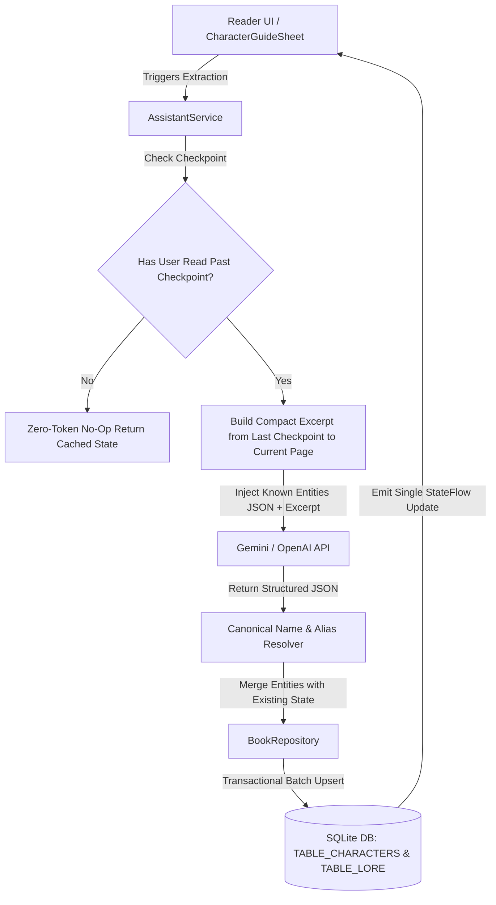
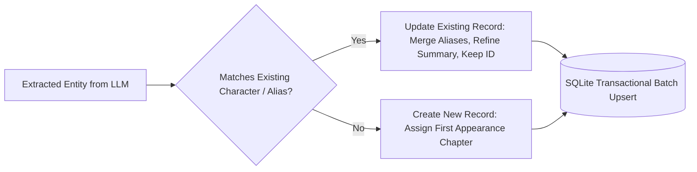
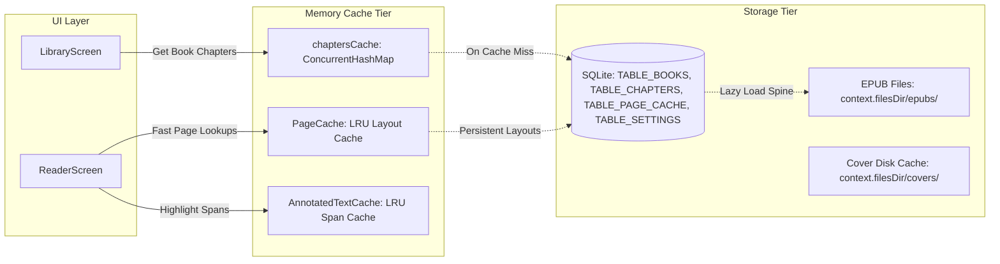
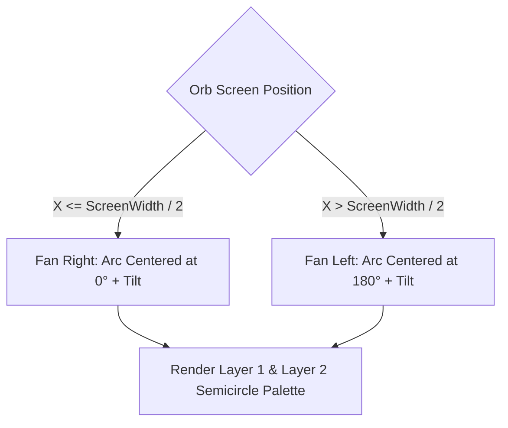

# Character Generation, Anti-Duplication & Architecture Guide

This document describes the architectural design, caching strategies, incremental AI character/lore generation flow, and deduplication protocols implemented in **Lumina**.

---

## 🏛️ System Overview & Architectural Choices



---

## 1. 🧠 Incremental AI Extraction & Anti-Duplication

### The Problem
Previously, running AI character generation repeatedly created duplicate entries in SQLite because:
1. `insertCharacter` executed unconditional row inserts with `id = 0`, ignoring existing records for the same character name.
2. The AI received raw chapter excerpts without structured JSON context of already-known characters, causing it to re-emit variations of known names (e.g. "Winston", "Mr. Winston Smith").
3. Each extracted character triggered an independent asynchronous coroutine emission, causing UI stutter and race conditions.

### The Solution

#### A. Structured Known-Context Prompt Injection
Every extraction call injects the current list of known characters and lore as compact JSON:
```json
{
  "reading_context": {
    "book_title": "Nineteen Eighty-Four",
    "previously_analyzed_chapter": 2,
    "current_reading_chapter": 5,
    "active_chapter_name": "Section 5"
  },
  "known_characters": [
    { "name": "Winston Smith", "role": "Protagonist", "summary": "...", "aliases": ["Winston", "Smith"] }
  ]
}
```

#### B. Canonical Entity & Alias Resolution
In `AssistantService.kt`, newly returned character objects are merged into existing records:
1. **Name Matching (`isSameCharacter`)**:
   - Compares normalized names (lowercased, stripped of titles like "Mr.", "Lord", "Dr.", and punctuation).
   - Checks against the known alias list.
   - Matches single-word surnames/first names to existing multi-word canonical names.
2. **Field Merging**:
   - **ID Preservation**: Keeps the existing database primary key ID.
   - **Canonical Name**: Retains the most descriptive/complete name.
   - **Aliases**: Unions all alternate names without duplicates.
   - **Summary & Key Events**: Refines description and appends newly revealed events up to the current reading position.



#### C. Database-Level Name-Based Upsert
In `LuminaDatabaseHelper.kt`, `insertCharacter` and `insertLore` query for matching records by `(book_id, LOWER(name))` before inserting:
- If a record with that name already exists for the book, it issues an `UPDATE` targeting that row ID.
- If no record exists, it issues an `INSERT`.
- Batch operations use `saveCharacters(bookId, list)` inside a single atomic SQLite transaction (`beginTransaction` / `setTransactionSuccessful`).
- On retrieval, `deduplicateCharacters(bookId)` and `deduplicateLore(bookId)` clean up any legacy duplicate rows.

---

## 2. ⚡ Text Serialization & Zero-Jank Caching

### Multi-Tier Caching Hierarchy



1. **Normalized Chunked Chapter Cache (`book_chapters`)**:
   - Holds book chapters in a normalized SQLite table with on-demand chunk loading and an in-memory `SimpleLruCache<String, List<Chapter>>`.
   - Complete architectural details: see [Startup & Reader Performance Guide](./startup-and-reader-performance.md).
2. **Persistent Layout Cache (`page_cache`)**:
   - Stores precomputed page layouts in SQLite so reader screens open instantly without blocking the main UI thread.
3. **FTS Table Fallback**:
   - `ensureBookFtsTableExists()` tests for `FTS5`, with graceful automatic fallback to `FTS4` or indexed standard tables on devices with restricted SQLite builds.
   - Automatic indexing is decoupled from startup to guarantee zero-latency launches.

---

## 3. 🌓 Floating Assistant Orb Geometry

The assistant orb uses a **concentric two-layered semicircle arc layout**:



- **Inward Directed**: The palette always expands into the visible screen area regardless of whether the orb is docked to an edge or floating freely.
- **Layer 1 (Inner)**: Primary actions (`TTS`, `Bookmark`, `Theme`, `Settings`).
- **Layer 2 (Outer)**: Extended actions (`Assistant Voice`, `In-Book Search`, `Fullscreen`, `Autoscroll`).
